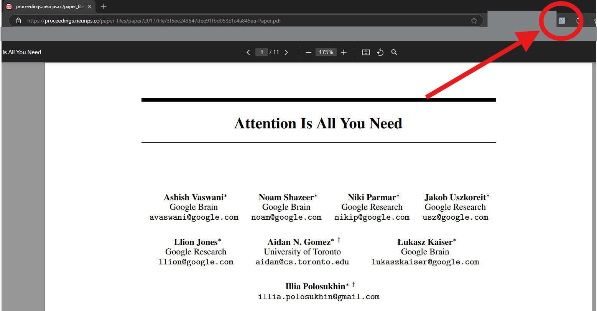
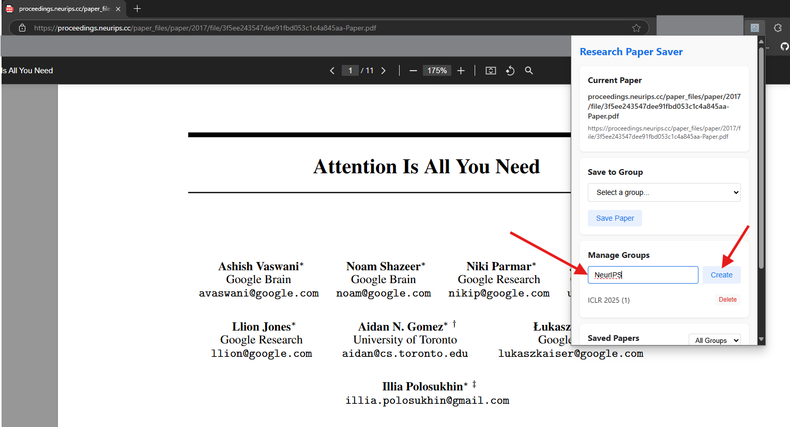
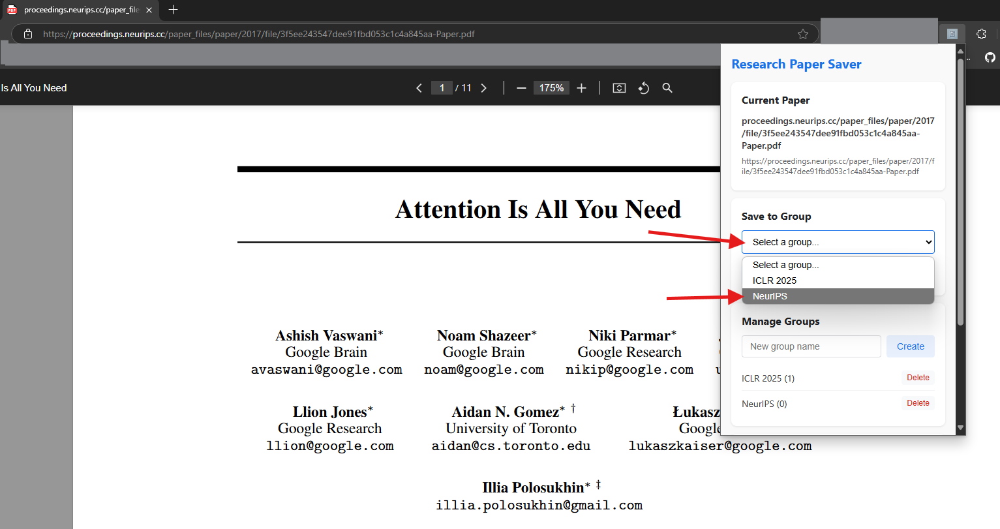
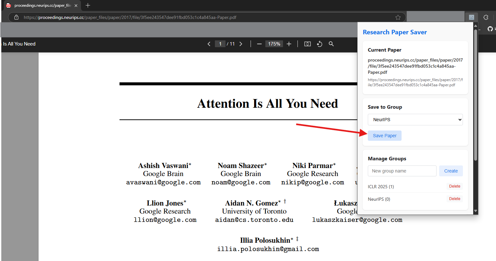
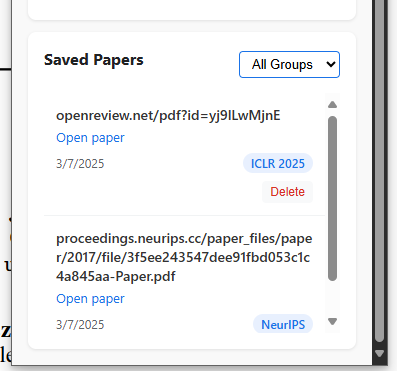
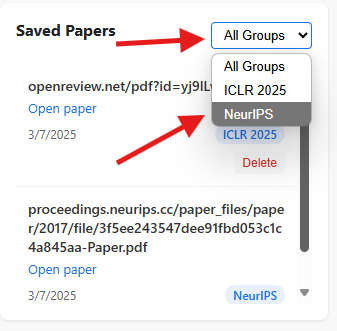
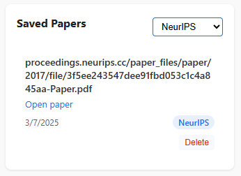

# Simple research paper saver

## About

A simple extension to save and organize your research papers (cause I'm sick of keeping track of it in docs and sheets).

## How To Use
1. Navigate to the releases to download the zip file or simple clone this repo.
```sh
git clone https://github.com/research-paper-extension
```
2. Go to the extensions tab in Edge or Chrome. I mainly developed this using MS Edge `edge://extensions/`.
3. Enable developer support (a formal release will be made soon to the extension stores).
4. Select the directory of this project/the unpacked directory if you're downloading a .zip file.
5. Open the extension. If you don't see it click on the puzzle icon on the top right. 
6. When you load it at first, you will need to create a new group before you can add papers (if you want a general paper dump, name the first group anything you like). 
7. Once you create a group, navigate to the **Save to Group** card above, and click on the group you want to save the paper to. 
8. Click on the Save Paper button 
9. Scroll down to see your saved papers. The default view shows all your papers (regardless of groups) \\ 
10. If you want to see your papers in groups, click on the dropout on the top-right of the card, and click on the group you want to filter \\ 
11. You can now see your papers filtered by groups \\ 

## Future releases
1. Add export to sheet or doc option later
2. Add option to download the saved groups to local/drive
3. Add option for users to color their groups
4. idk what else will think of stuff later...